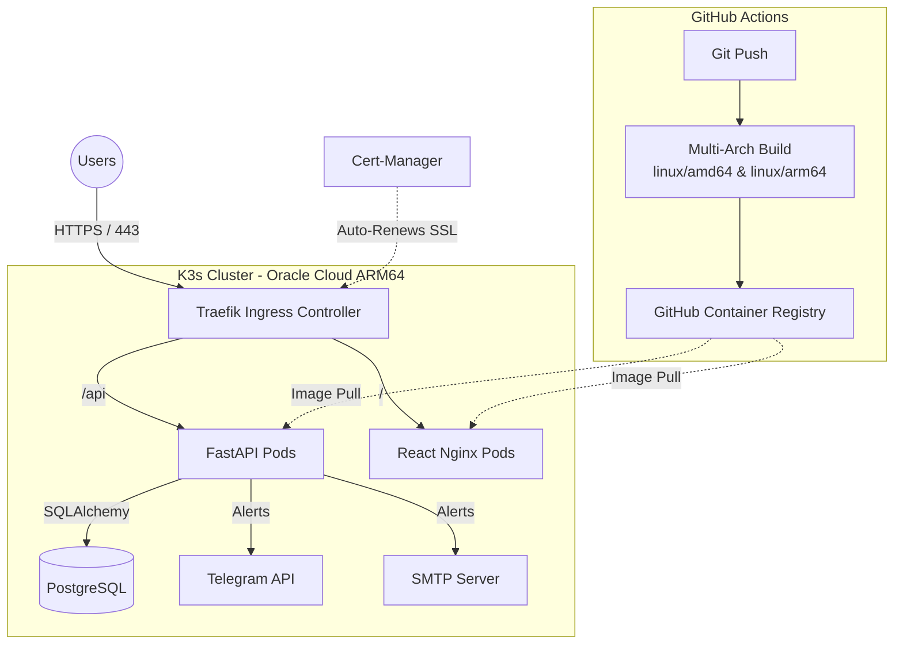

# Upfield - Modern Uptime Monitoring System


Upfield is a lightweight, high-performance, and visually aesthetic Uptime Monitoring SaaS application. It continuously monitors the health of configured endpoints and dispatches real-time alerts via Telegram and Email if an outage is detected.

## 🚀 Key Features
- **Real-Time Monitoring:** Asynchronous, non-blocking health checks for minimal overhead.
- **Dynamic Configuration:** Manage Telegram bots and SMTP settings directly from the UI without restarting the server.
- **High-Performance Backend:** Built with FastAPI and SQLAlchemy (PostgreSQL/SQLite).
- **Modern Dashboard:** React (Vite) + TailwindCSS + Shadcn UI with a highly polished, Vercel-like aesthetic (Light & Dark modes).
- **Two-Factor Authentication (Coming Soon):** JWT-based secure login with Google Authenticator (TOTP) support.

---

## 🏗️ DevOps & Cloud Architecture

Upfield is designed to be fully cloud-native. The production environment is hosted on **Oracle Cloud (ARM64)** using a GitOps-style Kubernetes approach.



### Infrastructure Highlights
- **Container Orchestration:** Deployed on **K3s** (Lightweight Kubernetes).
- **Multi-Arch CI/CD:** GitHub Actions pipeline natively builds Docker images for both `linux/amd64` and `linux/arm64` and pushes them to GHCR.
- **Zero-Downtime Deployments:** Managed via Kubernetes Deployments and Rolling Updates.
- **Automated Security:** `cert-manager` dynamically provisions and renews TLS certificates via Let's Encrypt.
- **Traffic Routing:** Domain-based routing and HTTP-to-HTTPS redirection handled by Traefik Middlewares.

---

## 💻 Local Development

To run the project locally for development or testing:

### 1. Backend Setup
```bash
cd backend
python -m venv venv
source venv/bin/activate
pip install -r requirements.txt
python -m app.main
```
*API will be available at `http://localhost:8000`*

### 2. Frontend Setup
```bash
cd frontend
npm install
npm run dev
```
*Dashboard will be available at `http://localhost:5173`*

---

## 🛡️ License
Copyright (c) 2026 Emre Şaşmaz.
This project is licensed under the MIT License.
